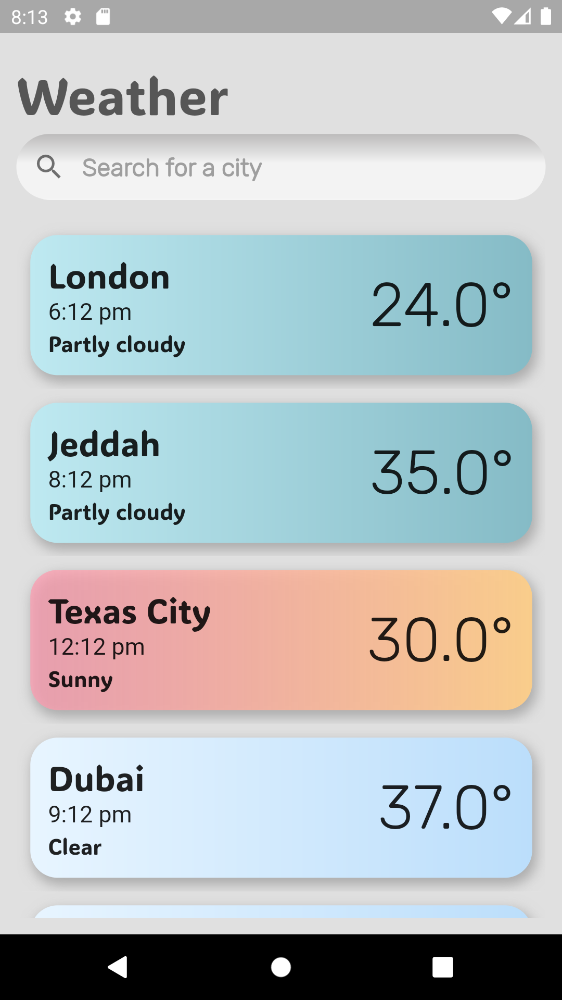
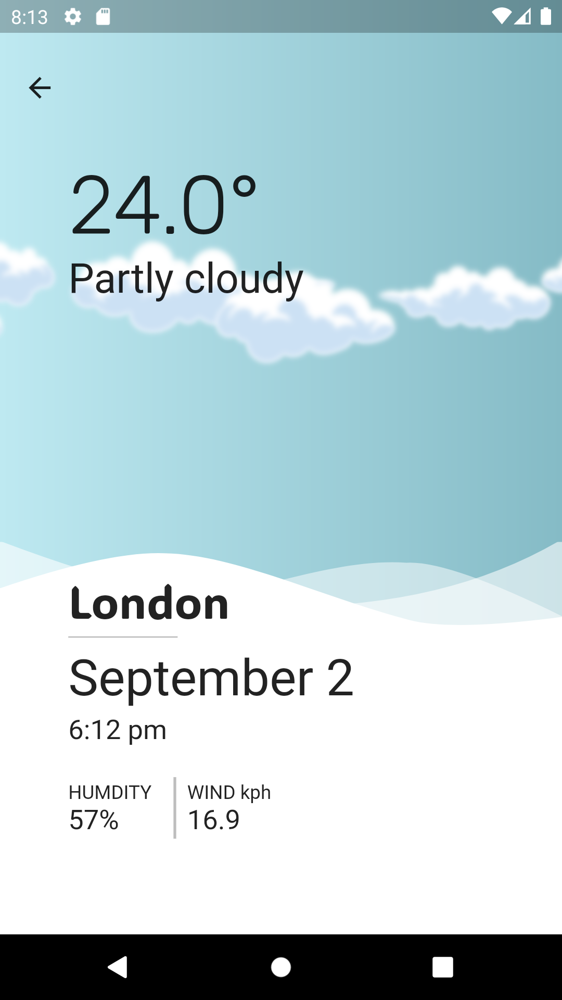
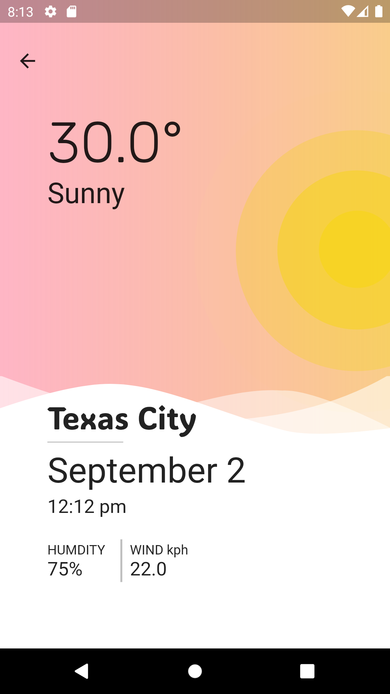
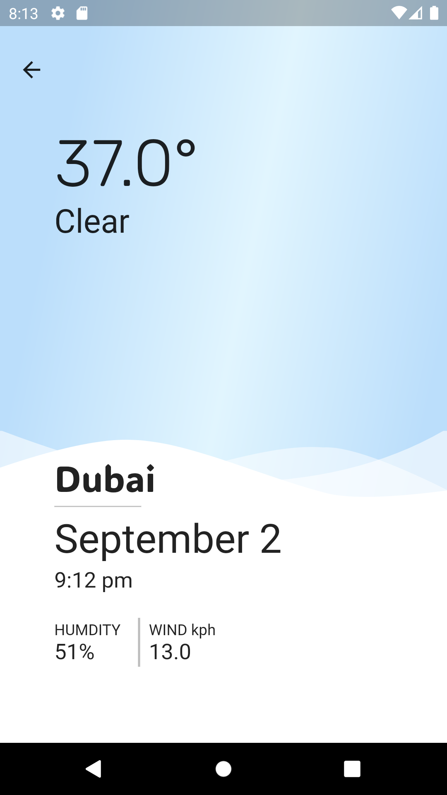

# weather_app
 
Hi everyone 
Here is our weather forecast application ,
We developed this application using flutter framework 
Our project was well structured and easy to understand 

We used :
-Supabase for our database 
-BLoc pattern implementation 
-Multiple packages
-animations 

Here is the Home Screen interface. 
This interface contains a list of the cities that is stored on the API.
this API will display simple information about the city's weather on each card.
the card color changes as the city's weather 

The next interface is the selected city interface. 
This interface will display all informations about the city's weather and the colors and animations change based on the weather

Thank you!

Team members:
Fahad alsahli
Majd
Mohammed alomari 
Ruba